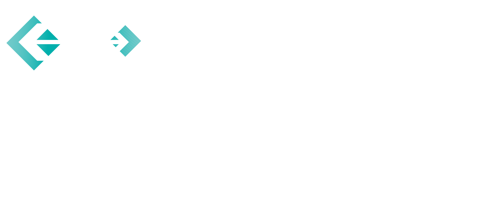

### Hi! I'm Shawn (he/him) 👋

I'm a Fullstack Software Engineer who has a passion for writing performant, scalable code in fascinating problem spaces.

What I use/know 🧰

 
 
 

Outside of coding, my hobbies include:
- Rock climbing
- Riding my bike around Boston
- Going to concerts
- Making espresso
- Collecting tattoos
- Growing plants

 

Feel free to connect with me on [LinkedIn](https://www.linkedin.com/in/shawn-toubeau/) and say Hi!
